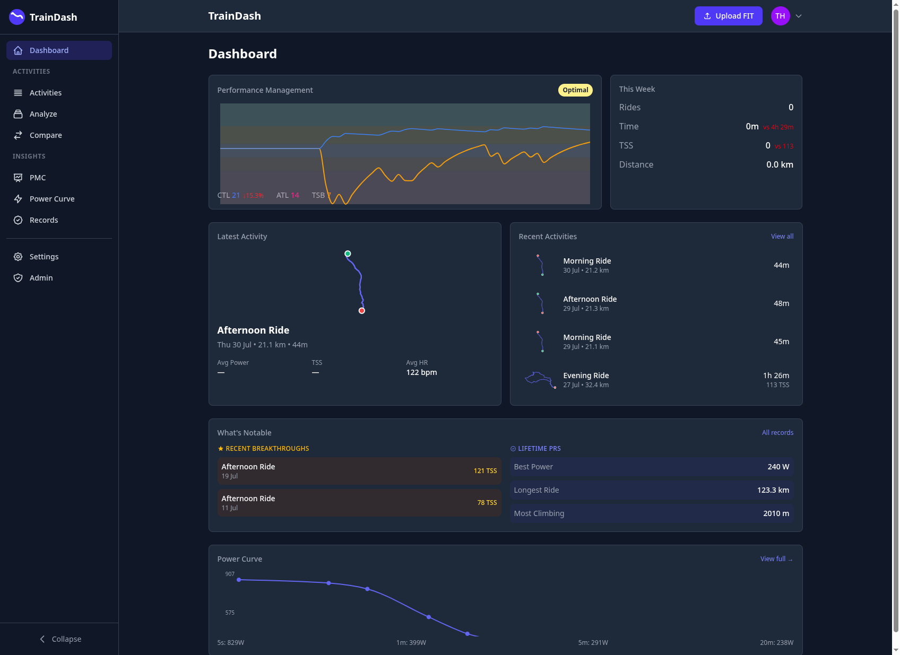
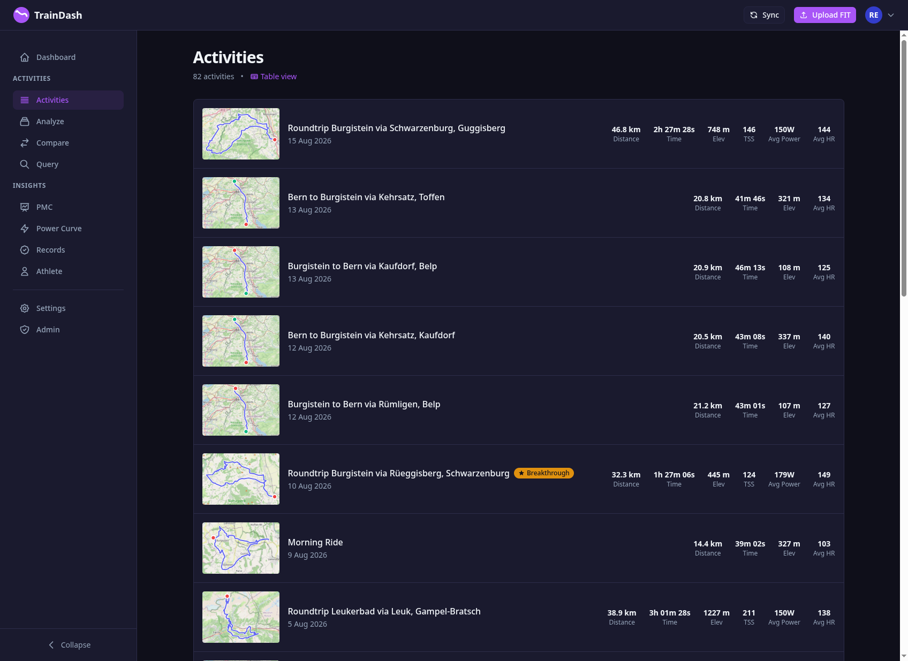
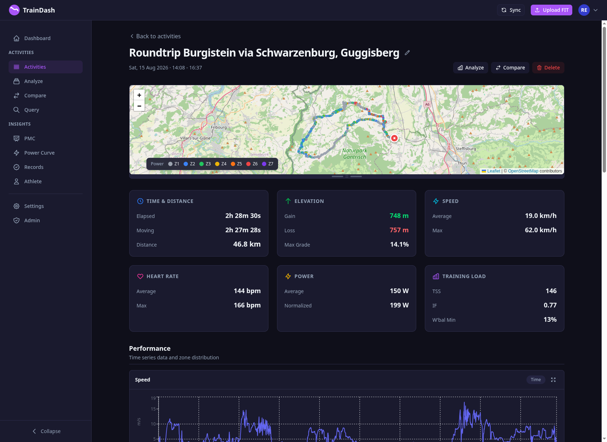
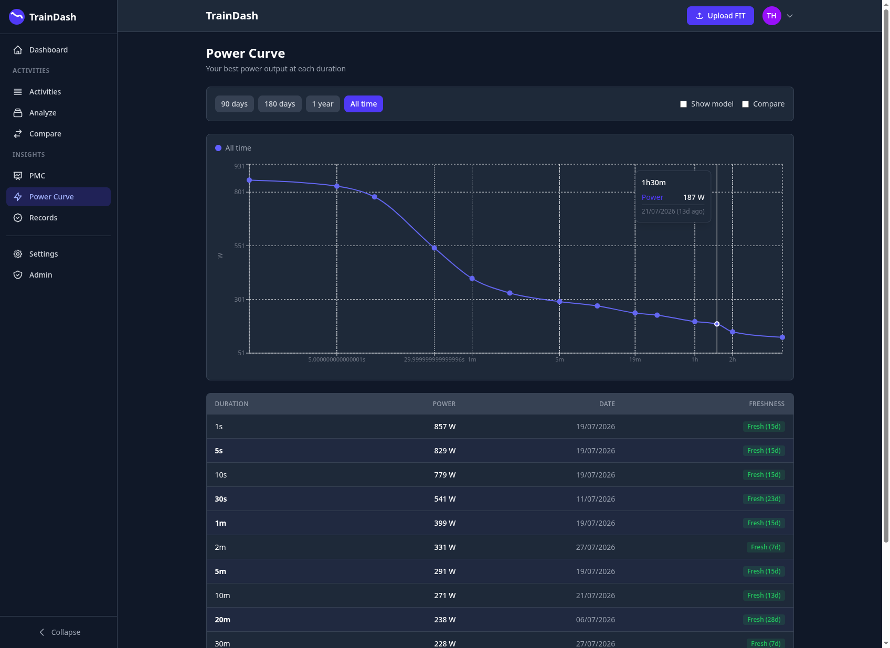
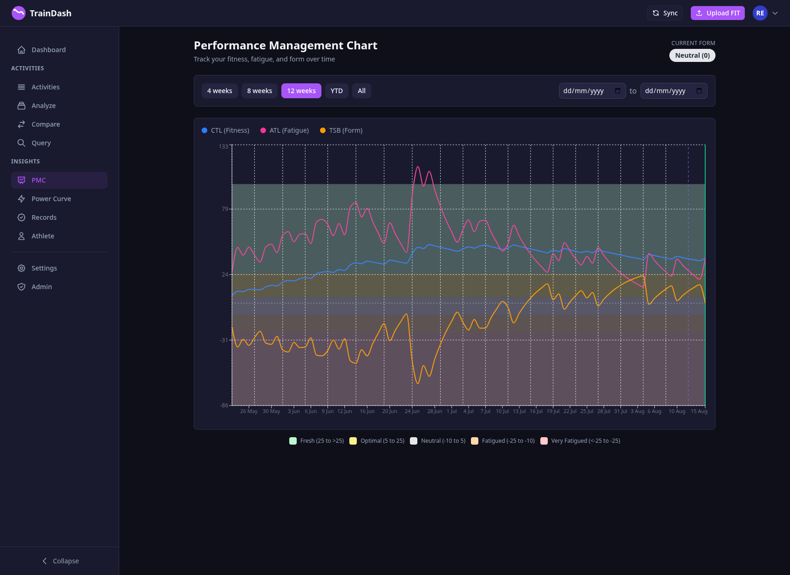
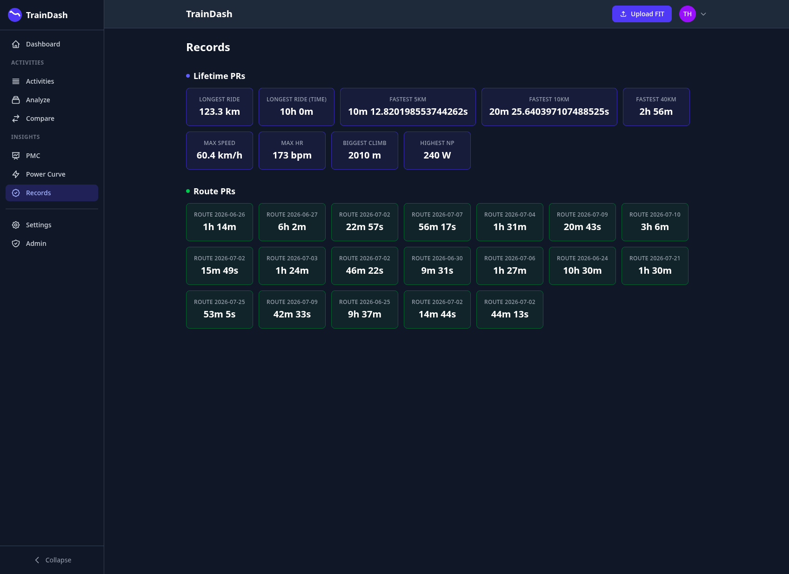

# TrainDash

[](https://github.com/tomberch/training-dash/actions/workflows/ci.yml)
[](LICENSE)
[](https://www.python.org/downloads/)
[](https://react.dev/)
[](https://docs.docker.com/compose/)

> [!WARNING]
> **This software is under heavy development. APIs are unstable and breaking changes happen without notice.**
> It is vibe-coded — built fast with AI assistance — which means it works, but carries all the bugs and rough edges that implies. Use it for personal exploration, not production workloads.

Self-hosted fitness analytics for cyclists and endurance athletes. Analyze your training data with interactive maps, performance charts, and personal records tracking.



## Features

**Activity Management**
- Upload and parse Garmin FIT files directly
- Automatic sync from Garmin Connect (with MFA support)
- Automatic sync from Xert
- Activity list with route map thumbnails
- Detailed activity view with interactive map and charts
- Delete individual activities (with async fitness recalculation)

**Performance Analytics**
- **PMC (Performance Management Chart)** — Track CTL (fitness), ATL (fatigue), and TSB (form) over time with color-coded training zones
- **Power Curve** — Best power outputs at each duration with freshness indicators
- **HR Zones** — Time-in-zone breakdown for each activity

**Personal Records**
- Lifetime PRs (longest ride, fastest segments, max power, biggest climb)
- Per-route PRs with automatic route matching via GPS similarity

**Multi-User**
- Isolated data per user
- Admin panel for user management
- Metric/Imperial unit preferences

## Screenshots

<details>
<summary>Activity List</summary>



</details>

<details>
<summary>Activity Detail</summary>



</details>

<details>
<summary>Power Curve</summary>



</details>

<details>
<summary>Performance Management Chart</summary>



</details>

<details>
<summary>Records</summary>



</details>

## Quick Start

```bash
git clone https://github.com/tomberch/training-dash.git
cd training-dash
docker compose up
```

Open http://localhost:8000 and log in with the seed admin account:
- **Email:** `admin@example.com`
- **Password:** `admin` (or value of `ADMIN_PASSWORD` env var)

To sync activities from Garmin or Xert, go to **Settings > Integrations**.

## Tech Stack

| Layer | Technology |
|-------|------------|
| Frontend | React 19, TypeScript, Tailwind CSS 4, Vite, Recharts, Leaflet |
| Backend | Python 3.12, FastAPI, SQLAlchemy 2, Pydantic |
| Database | PostgreSQL 16 with PostGIS |
| Queue | Redis + arq (background job processing) |
| Container | Docker Compose |

## Documentation

- [Getting Started](docs/getting-started.md) — Installation, configuration, first steps
- [Architecture](docs/architecture.md) — System design and code organization
- [API Reference](docs/api.md) — REST API endpoints
- [Contributing](CONTRIBUTING.md) — How to contribute

## Development

### Prerequisites

- Docker and Docker Compose
- Node.js 20+ (for frontend development)
- Python 3.12+ and uv (for backend development)

### Local Development

**Backend:**
```bash
cd backend
uv sync
source .venv/bin/activate
pytest  # run tests
```

**Frontend:**
```bash
cd frontend
npm install
npm run dev  # starts dev server on :5173
```

**Full stack with hot reload:**
```bash
# Terminal 1: Database + Redis
docker compose up db redis

# Terminal 2: Backend
cd backend && source .venv/bin/activate
uvicorn trainingdash.app:app --reload

# Terminal 3: Frontend
cd frontend && npm run dev
```

## License

[MIT](LICENSE)
