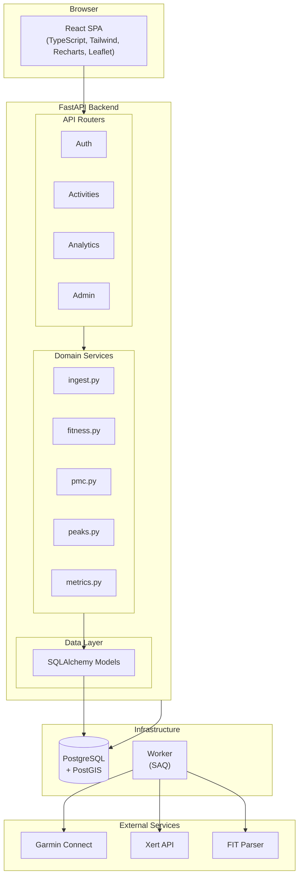

# Architecture

This document describes TrainDash's system design and code organization for developers.

## System Overview



## Backend Structure

The backend follows a Clean Architecture pattern (see [ADR-0002](adr/0002-clean-architecture.md)) with clear separation between layers:

```
backend/src/trainingdash/
├── app.py              # FastAPI application setup, middleware, static files
├── config.py           # Environment configuration (Settings class)
├── auth.py             # Authentication (JWT sessions, password hashing)
├── crypto.py           # Credential encryption (Fernet)
│
├── domain/             # Pure business logic (no I/O dependencies)
│   ├── fitness.py      # TSS, IF, NP calculations
│   ├── pmc.py          # Performance Management Chart (CTL/ATL/TSB)
│   ├── peaks.py        # Peak power detection algorithms
│   ├── metrics.py      # Training metrics computation
│   ├── wbal.py         # W'bal (anaerobic capacity) tracking
│   ├── zones.py        # HR/power zone calculations
│   ├── polyline.py     # Google polyline encoding
│   └── resampler.py    # Time-series resampling
│
├── repositories/       # Data access abstractions
│   ├── protocols.py    # Repository interfaces (ActivityRepo, UserRepo, etc.)
│   └── postgres/       # PostgreSQL implementations
│       ├── activity_repo.py
│       ├── user_repo.py
│       ├── models.py   # SQLAlchemy ORM models
│       └── db.py       # Database session management
│
├── use_cases/          # Application business operations
│   ├── ingest_activity.py    # FIT file parsing and storage
│   ├── delete_activity.py    # Activity deletion with cleanup
│   ├── sync_from_provider.py # External provider sync
│   └── recalculate_metrics.py # Batch metric recalculation
│
├── routers/            # HTTP API endpoints
│   ├── activities.py   # /api/activities/* (CRUD, upload, detail)
│   ├── analytics.py    # /api/analytics/* (PMC, power curve, records)
│   ├── admin.py        # /api/admin/* (user management, sync)
│   ├── auth.py         # /api/auth/* (login, logout)
│   ├── user.py         # /api/me/* (preferences, integrations)
│   ├── metrics.py      # /api/me/metrics/* (thresholds, zones)
│   └── serializers.py  # Pydantic request/response models
│
├── integrations/       # External service clients
│   ├── protocols.py    # SyncProvider interface
│   ├── xert.py         # Xert API client
│   └── garmin.py       # Garmin Connect client
│
├── dependencies.py     # FastAPI dependency injection factories
├── ingest.py           # FIT parsing and legacy ingest functions
├── sync_providers.py   # Provider implementations (XertSyncProvider, etc.)
├── queue.py            # SAQ queue configuration (Postgres backend)
├── jobs.py             # Job enqueue helpers
├── worker.py           # SAQ worker settings and job definitions
└── init_db.py          # Database initialization script
```

### Layer Dependencies

```
routers → use_cases → repositories (protocols)
              ↓              ↓
           domain      postgres (implementations)
```

- **Routers** call use cases, never repositories directly
- **Use cases** depend on repository protocols (interfaces), not implementations
- **Domain** modules are pure functions with no I/O
- **Repositories** implement protocols and handle database operations

## Frontend Structure

```
frontend/src/
├── main.tsx            # React entry point
├── App.tsx             # Router setup, auth context
├── api.ts              # API client (fetch wrappers, types)
├── format.ts           # Formatting utilities (distance, duration, pace)
├── resampler.ts        # Client-side data resampling
├── prs.ts              # Personal records calculation
│
├── pages/              # Route-level components
│   ├── Dashboard.tsx       # Home page with PMC, recent activities, PRs
│   ├── ActivityTable.tsx   # Sortable table view of activities
│   ├── AnalyzePage.tsx     # Deep activity analysis
│   ├── ComparePage.tsx     # Compare two activities
│   ├── PMCView.tsx         # Full PMC chart page
│   └── PowerCurveView.tsx  # Power curve analysis
│
├── components/         # Reusable UI components
│   ├── PolylineMap.tsx     # SVG polyline renderer (no tile server)
│   ├── MiniMap.tsx         # Leaflet map for activity detail
│   ├── Pagination.tsx      # Page navigation
│   └── ...
│
├── ActivityDetail.tsx  # Single activity view
├── ActivityList.tsx    # Activity list with thumbnails
├── RecordsView.tsx     # Lifetime and route PRs
├── Settings.tsx        # User preferences and integrations
├── AdminView.tsx       # Admin panel
├── Header.tsx          # Top navigation bar
├── Sidebar.tsx         # Left navigation
└── hooks/              # Custom React hooks
```

## Data Flow

### Activity Upload

1. User uploads FIT file via `/api/activities/upload`
2. `ingest.py` parses FIT file using `fitdecode`
3. Creates `Activity` and `Record` rows in database
4. Computes metrics (TSS, NP, IF) via `fitness.py`
5. Detects peaks via `peaks.py`
6. Matches to existing routes via `route_matching.py`
7. Generates polyline for map thumbnail via `polyline.py`
8. Returns activity ID to frontend

### Background Sync

1. Scheduled job runs at 2 AM (Xert) or 3 AM (Garmin)
2. Worker picks up job from Redis queue
3. Fetches new activities from provider API
4. For each activity, runs the same ingest pipeline as upload
5. Updates `last_synced_at` on user's credentials

### PMC Calculation

1. Frontend requests `/api/analytics/pmc?start=...&end=...`
2. `pmc.py` queries activities in date range
3. Calculates daily TSS, then rolling CTL (42-day) and ATL (7-day)
4. TSB = CTL - ATL
5. Returns time series for charting

## Database Schema

Key tables:

- **users** — Account info, preferences, admin flag
- **activities** — Summary data (distance, duration, TSS, etc.)
- **records** — Per-second data points (lat, lon, HR, power, speed)
- **peaks** — Best efforts at standard durations (5s, 1m, 5m, 20m, etc.)
- **routes** — Clustered GPS paths for route matching
- **garmin_credentials** / **xert_credentials** — Encrypted provider auth
- **audit_log** — Admin action history

PostGIS is used for:
- Storing GPS tracks as `LINESTRING` geometry
- Route matching via `ST_HausdorffDistance`
- Bounding box queries for map views

## Key Design Decisions

See [docs/adr/](adr/) for Architecture Decision Records:

- **ADR-0001**: Hard delete for nuke actions (no soft delete or trash)
- **ADR-0002**: Clean Architecture — separates domain, use cases, repositories, and routers

### Why Clean Architecture?

The codebase needed clearer boundaries as it grew. Clean Architecture provides:
- **Testability**: Use cases can be tested with fake repositories (no database)
- **Maintainability**: Changes to database don't affect business logic
- **AI-navigability**: Clear conventions for where code belongs

### Why PostGIS?

Route matching needs spatial operations. Hausdorff distance between simplified polylines determines if two activities follow the same route. PostGIS handles this efficiently.

### Why SAQ + Postgres?

Background sync jobs can take minutes (fetching from Garmin, parsing large FIT files). SAQ provides reliable job processing with retries, using Postgres as the queue backend — eliminating the need for a separate Redis instance and simplifying operations.

### Why Polyline Thumbnails?

Activity list shows 20+ activities per page. Loading Leaflet maps for each would be slow. Instead, we store a simplified Google-encoded polyline and render it as pure SVG — no tile server needed.

## Testing

```bash
# Backend (uses testcontainers for PostgreSQL)
cd backend
pytest

# Frontend (Vitest + Testing Library)
cd frontend
npm test
```

Integration tests use testcontainers to spin up real PostgreSQL instances.
